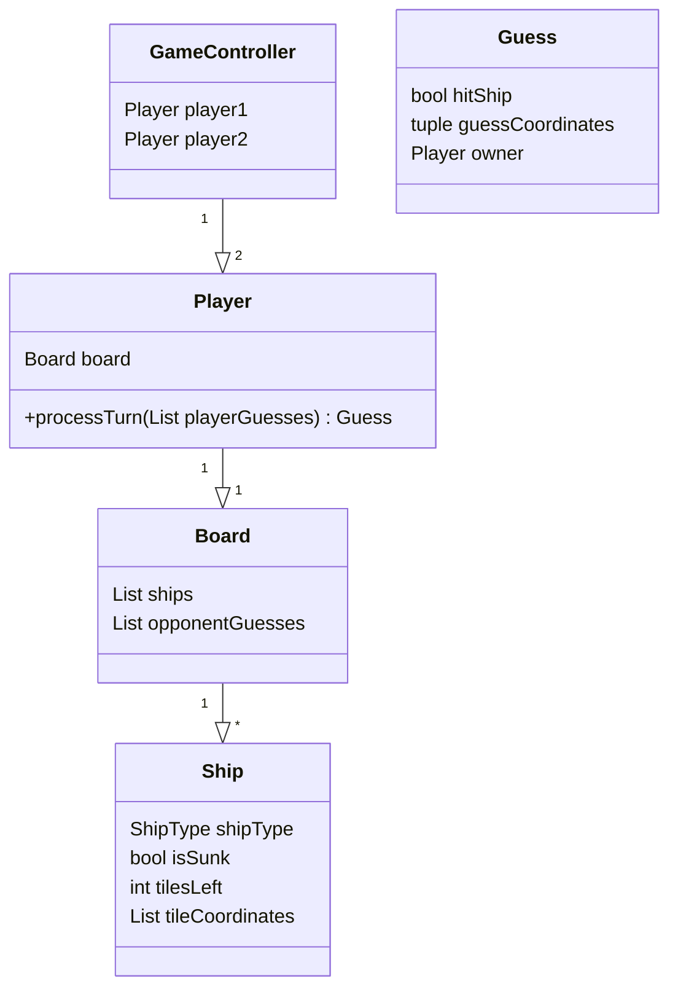

# Arkkitehtuuri

## Sovelluslogiikka

```mermaid
 classDiagram

    Player "1" --|> "1" Board
    Board "1" --|> "*" Ship
    GameController "1" --|> "2" Player

    class Guess{
        bool hitShip
        tuple guessCoordinates
        Player owner
    }
    class Player{
        Board board
        +processTurn(List<Guess> playerGuesses) Guess
    }
    class Ship{
        ShipType shipType
        bool isSunk
        int tilesLeft
        List<tuple> tileCoordinates
    }
    class Board{
        List<Ship> ships
        List<Guess> opponentGuesses
    }
    class GameController {
        Player player1        
        Player player2
    }
```
