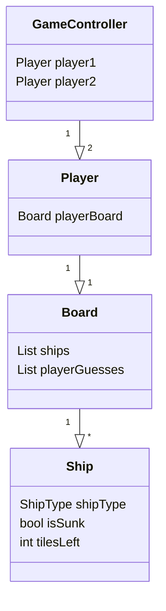

# Arkkitehtuuri

## Sovelluslogiikka

```mermaid
 classDiagram

    Player "1" --|> "1" Board
    Board "1" --|> "*" Ship
    GameController "1" --|> "2" Player

    class Player{
        Board playerBoard
    }
    class Ship{
        ShipType shipType
        bool isSunk
        int tilesLeft
    }
    class Board{
        List ships
        List playerGuesses
    }
    class GameController {
        Player player1
        Player player2
    }
```
