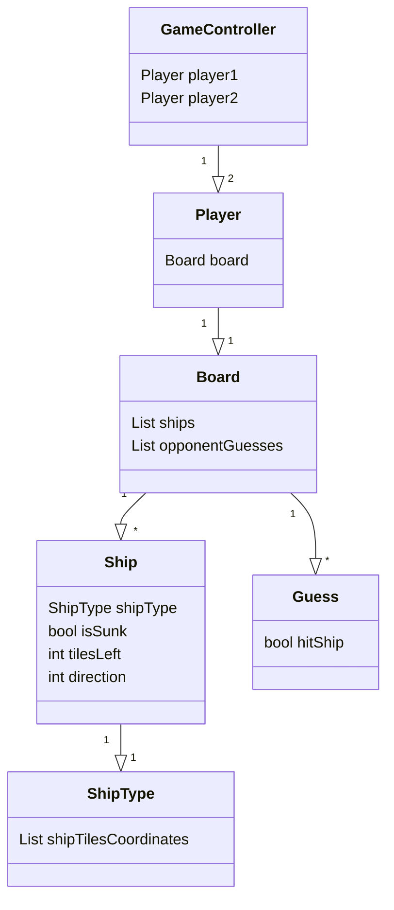

# Arkkitehtuuri

## Sovelluslogiikka

`GameController`-luokka sisältää pelaaja oliot sekää huolehtii pelin vuoroista ja niiden käsittelystä.

`Player`-luokka sisältää pelilaudan, johon pelaaja on asettanut omat aluksensa. Pelaaja voi joko saada joko käyttäjältä tai tekoälyltä komentoja.

`Board`-luokka sisältää aluksia sekä vastustajan tekemät arvaukset ja osumat. Se myös huolehtii pelilautaan liittyvistä ominaisuuksista,
kuten mihin tietynlaisen aluksen voi asettaa.

`Ship`-luokka sisältää tietoa aluksesta, kuten minkä tyyppinen se on tai onko se upotettu.

`Guess`-luokka sisältää tietoa yhdestä pelaajan arvauksesta, kuten osuiko se alukseen vai ei.

`ShipType`-luokka sisältää tietoa yhdestä alustyypistä, kuten minkä muotoinen alus on.

## Pelimoottori

TODO

