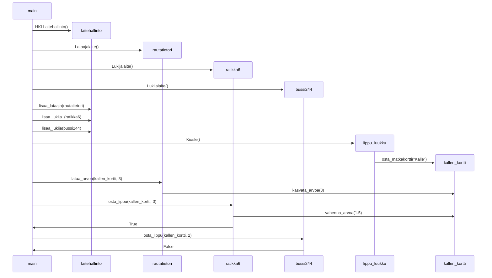

## HSL, sekvenssidiagrammi

```mermaid
sequenceDiagram
    participant main
    create participant laitehallinto
    main->>laitehallinto: HKLLaitehallinto()
    create participant rautatietori
    main->>rautatietori: Lataajalaite()
    create participant ratikka6
    main->>ratikka6: Lukijalaite()
    create participant bussi244
    main->>bussi244: Lukijalaite()

    main->>laitehallinto: lisaa_lataaja(rautatietori)
    main->>laitehallinto: lisaa_lukija_(ratikka6)
    main->>laitehallinto: lisaa_lukija(bussi244)

    create participant lippu_luukku
    main->>lippu_luukku: Kioski()

    create participant kallen_kortti
    lippu_luukku->>kallen_kortti: osta_matkakortti("Kalle")

    main->>rautatietori: lataa_arvoa(kallen_kortti, 3)
    rautatietori->>kallen_kortti: kasvata_arvoa(3)

    main->>ratikka6: osta_lippu(kallen_kortti, 0)
    ratikka6->>kallen_kortti: vahenna_arvoa(1.5)
    ratikka6->>main: True
    main->>bussi244: osta_lippu(kallen_kortti, 2)
    bussi244->>main: False
```